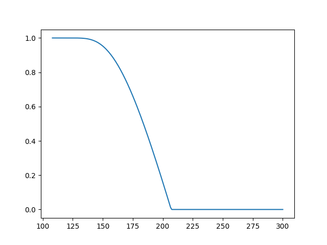

# 面向对象第一单元第三次作业指导书

## 摘要

本次作业，需要完成的任务为**包含简单幂函数和简单正余弦函数及其嵌套组合函数的导函数**的求解。

## 问题

### 设定

首先是一些基本概念的声明：

- **带符号整数** **支持前导0**的**十**进制带符号整数（若为正数，则正号可省略），无进制标识，如： `+02`，`-16`，`19260817`。

- **因子**

  - **常数因子** 包含一个带符号整数，如：`233`。
    
  - **变量因子**

    - **幂函数**

      - **一般形式** 由自变量x，指数符号`**`和指数组成，指数为一个带符号整数，如：`x ** +2`。
      - **省略形式** 当指数为1时，可省略指数符号`**`和指数，如：`x`。

    - 允许**嵌套因子**的**三角函数** 

      本次作业允许**将任意因子嵌套至三角函数中**，并**将嵌套后的整体作为一个因子**。

      - **一般形式** 类似于幂函数，由`sin(<因子>)`或`cos(<因子>)` 、指数符号`**`和指数组成，其中：

        - `<因子>`指任意一个因子，如：`233`，`x`，`x**2`，`sin(x)`，`(x**2 + 2*x)`。
        - 指数为一个带符号整数。

        例：`sin(x) ** +2`，`sin(x**2)**3`。

      - **省略形式** 当指数为1时，可省略指数符号`**`和指数。
        
          例：`cos(sin(x))` ， `cos((x**2 + 2*x))`。

      几个综合的例子：`sin((2*x))`，`cos((-sin(x)))`，`sin(sin(cos(cos(x**2)**3)))**4`。

  - **表达式因子** 由一对小括号及其包裹的表达式组成，如：`(x**2 + 2*x)`。表达式的定义将在表达式的相关设定中进行详细介绍。

  - **补充**

    - **表达式因子不支持幂运算**，例如`(1113*x)**62621`**不是合法的因子**。

- **项**

  - **一般形式** 由乘法运算符连接若干因子组成，如：`x * cos(x) * x`，`sin(x ** 2) * cos(sin(x)) ** 2 * x ** 2` 。
  - **特殊形式**
    - 第一个因子为常数因子，值为1且**总共不止有一个因子**时，可省略该常数因子或表示为正号开头的形式，如：`x ** 2 * x ** 1`，`+ x ** 2`，`+ cos(x) * cos(x)`，`sin(x) * cos(x)`。
    - 第一个因子为常数因子，值为-1且**总共不止有一个因子**时，可表示为负号开头的形式，如：`-x ** 2`，`- cos(x) * sin(x)`。

- **表达式** 由加法和减法运算符连接若干项组成，如： `(-1 + x ** 233)* sin(x**2) ** 06 - cos(sin(x)) * 3 * sin((x))`。此外，**在第一项之前**，**可以带一个正号或负号**，来表示第一项的正负，如：`- -1 + x ** 233`，`+ -2 + x ** 1113`。

  - **项**的个数至少为一，**空串不属于合法的表达式**。
  - 由表达式的定义可知，表达式因子可存在递归嵌套，如：`(x**2 + (1 + 2*x))`。

- **空白字符** 在本次作业中，空白字符包含且仅包含空格`<space>`（ASCII值32）和水平制表符`\t`（ASCII值9）。其他空白字符，均属于非法字符。

  对于空白字符，有以下几条规定：

  - 带符号整数内不允许包含空白字符，注意带符号整数本身的**符号与整数之间**也不允许包含空白字符。
  - 指数运算符内不允许包含空白字符，如`*  *`不合法。 
  - 三角函数的保留字内不允许包含空白字符，即`sin`，`cos`关键字内不可以含有空白字符。
  - 因子、项、表达式，在不与以上三条规定矛盾的前提下，可以在任意位置包含任意数量的空白字符。

### 设定的形式化表述

- 表达式 $\rightarrow$ 空白项 [加减 空白项] 项 空白项 | 表达式 加减 空白项 项 空白项
- 项 $\rightarrow$ [加减 空白项] 因子 | 项 空白项 * 空白项 因子
- 因子 $\rightarrow$ 变量因子 | 常数因子 | 表达式因子
- 变量因子 $\rightarrow$ 幂函数 | 三角函数
- 常数因子 $\rightarrow$ 带符号的整数
- 表达式因子 $\rightarrow$ '(' 表达式 ')'
- 三角函数 $\rightarrow$ sin 空白项 '(' 空白项 因子 空白项 ')' [空白项 指数] | cos 空白项 '(' 空白项 因子 空白项 ')' [空白项 指数]
- 幂函数 $\rightarrow$ x [空白项 指数]
- 指数 $\rightarrow$  ** 空白项 带符号的整数
- 带符号的整数 $\rightarrow$ [加减] 允许前导零的整数
- 允许前导零的整数 $\rightarrow$ (0|1|2|…|9){0|1|2|…|9}
- 空白字符 $\rightarrow$ ` `（空格） | `\t`（水平制表符）
- 空白项 $\rightarrow$ {空白字符}
- 加减 $\rightarrow$ + | -

其中{}表示0个、1个或多个，[]表示0个或1个，|表示多个之中选择。

式子的具体含义参照其数学含义。

若输入字符串能够由“表达式”推导得出，则输入字符串合法，否则不合法。具体推导方法请参阅“第一单元形式化表述说明”文档。

### 描述

求导是数学计算中的一个计算方法，其定义为，当自变量的增量趋于零时，因变量的增量与自变量的增量之商的极限。

在本次作业中，需判断输入表达式是否合法（即是否符合前述表达式基本规则），进行求导运算，化简并输出运算结果。

**本次作业可能用到的求导公式有： **
$$
Ⅰ. 当f(x) = c（c为常数）时，f'(x) = 0
$$

$$
Ⅱ. 当f(x) = x^n（n≠0）时，f'(x) = nx^{n-1}
$$

$$
Ⅲ. 当f(x) = \sin(x)时，f'(x) = \cos(x)
$$

$$
Ⅳ. 当f(x) = \cos(x)时，f'(x) = -\sin(x)
$$

$$
Ⅴ. 链式法则：[f(g(x))]' = f'(g(x))g'(x)
$$

$$
Ⅵ. 乘法法则：[f\left(x\right)g\left(x\right)]' = f'\left(x\right)g\left(x\right)+f\left(x\right)g'\left(x\right)
$$

### 一些规定

- 一个表达式可能有多个解释。因此，对于一个表达式，只要存在一条合法解释，该表达式即合法，我们保证这些解释在数学意义上均相等。
- 为了方便评测机评测，限制输入表达式中出现的指数（包括幂函数和三角函数）**绝对值不超过$50$**（十进制），超过此范围需要输出`WRONG FORMAT!`。 
- 将`0**0`定义为`1`（例如`sin(0)**0`），即c标准库和python标准库中的定义。

## 判定

### 输入格式

输入中，包含且仅包含一行，表示一个表达式。

### 数据限制

* **数据的最大长度为70**。（请注意，这里不是有效长度，是去除右侧换行符后的总长度）
* 数据中不会出现底数恒等于0，指数为负数的情况（例如`sin(0)**-1`）

在测试中，不会出现不符合以上限制的数据。在以上限制外，不作任何其他限制。

### 输出格式

- 如果是一组合法的输入数据，则应当输出一行，表示求得的导函数。格式同样需要符合前述表达式基本规则，其中要求带符号整数均为**十进制形式**。
- 为了方便评测，输出的表达式的**所有指数的绝对值不得超过$10^{10}$**，且**输出总长度不得超过$10^4$**。不符合该要求的输出视为**输出错误**。例如对于输入`x`，若输出为`0 * x ** 10000000001 + 1`，则认定为输出错误。显然，在前述数据限制下，正确的输出可以不出现指数的绝对值超过$10^{10}$以及总长度超过$10^4$的情况。
- 如果是一组不合法的输入数据，则应当输出一行`WRONG FORMAT!`

### **判定模式**

#### 正确性判定

对于这次作业结果正确性的判定，在输出符合格式要求的前提下，我们采用如下的方式：

* **在区间$ [-10, 10] $上，进行1000次线性随机选取**，设得到的数为$\left\{ x_{i} \right\}(1 \leq i \leq 1000)$
* 设输入表达式为$f\left(x\right)$，其导函数为$f'\left( x \right)$（即正确答案，由sympy进行符号运算），将$\left\{ x_{i} \right\}$依次代入$f'\left(x\right)$，得到结果$\left\{ a_{i} \right\}$
* 设待测输出表达式为$g'\left(x\right)$，将$\left\{x_i\right\}$依次代入$g'\left(x\right)$，得到结果$\left\{ b_i \right\}$
* 将数列$\left\{a_i\right\}$和数列$\left\{b_i\right\}$进行比较，判定每个数是否依次相等
* **如果全部相等，则认为该组输出正确**，否则认为错误。

其中

* 在比较两个数时，**判定相等的依据**是：对于数$a_i$表示正确结果，数$b_i$表示根据输出计算出的结果，若满足

$$
\frac{\left| a_i - b_i \right|}{\max\left( \left| a_i \right|, 1 \right)} < {10}^{-3}
$$

则视为$a_i$与$b_i$相等。

+ 考虑到可能会出现随机出的数位于无意义点上导致计算出错，故在上述计算$b_i$的过程中，**如果第$i$个数计算错误，则将重新生成该$x_i$，并重新计算**。每个数最多将会重试五次，如果重试次数达到上限后依然无法正常计算，则判定该组输出错误。**举例说明的话，就是表达式$\frac{x^2}{x}$最终也会被判定为和表达式$x$等价**。（由$a_i$不可计算引发的重新计算将不被计算在这五次内）

简而言之，可以理解为：**只要是和标准结果等价的表达式（允许定义域上的点差异），都会被认定为正确答案**。

#### 性能分判定

在本次作业中，性能分的唯一评判依据，是输出结果的有效长度。

有效长度定义为，输出结果去除所有的空白字符（`<space>`、`\t`）后的长度，设为$L$。

设某同学给出的正确答案的有效长度为$L_p$，所有人目前给出的正确答案的有效长度的最小值为$L_{min}$，最大值为$L_{max}$，平均值为$L_{avg}$。

设 

$base_{min} = p\cdot L_{avg}+(1-p)\cdot L_{min}$，

$base_{max}=p\cdot L_{max}+(1-p)\cdot L_{avg}$，

$p=0.07$

则该同学性能分百分比为：
$$
r(L_p)= 100 \% \cdot
\begin{cases}
1 & L_p \leq base_{min} \\
1-10^{1-\frac{base_{max}-base_{min}}{L_p-base_{min}}} & base_{min} < L_p \leq base_{max} \\
0 & L_p > base_{max}
\end{cases}
$$
以下是用正态分布生成的一组数据，模拟的性能分得分情况，

在格式错误的情况下，输出是固定的，所以对于格式错误的数据点，只要被判定为正确即可获得$100\%$的性能分。

需要注意的是，**获得性能分的前提是，在正确性判定环节被判定为正确**。如果被判定为错误，则性能分部分为0分。

**注：**本次作业强测中性能分占比为**20%**

### 互测相关

在互测环节

* **数据的最大长度为40**。（请注意，这里不是有效长度，是去除右侧换行符后的总长度）
* 数据需保证**表达式一定合法**。（即，互测环节不允许输出为`WRONG FORMAT!`的数据）
* **对于符合表达式格式的输入数据，其正确导函数在$[-10,10]$的范围内不存在值超过$10^{20}$的点**。
* **所有指数严格大于0**。

对于限制的第三条，互测时判定方式如下：

+ **在区间$ [-10, 10] $上，线性随机选取$5000$个数**，设为$\left\{ x_{i} \right\}(1 \leq i \leq 5000)$

- 设输入表达式为$f\left(x\right)$，其导函数为$f'\left( x \right)$（即正确答案，由sympy进行符号计算并求导），将$\left\{ x_{i} \right\}$依次代入$f'\left(x\right)$ ，得到结果$\left\{ a_{i} \right\}$（使用sympy设置合适的精度进行计算）
- 如果满足$\forall 1 \leq i \leq 5000, \left| a_i \right| \leq 10^{20}$，则输入数据判定为满足这一要求，否则判定为不满足。

如果不满足上述数据限制，或者未通过上述方式的评判的，该数据将被系统忽略，不会对被测程序进行测试。

## 样例

|  #   | 输入                     | 输出                                           | 解释                                                       |
| :--: | ------------------------ | ---------------------------------------------- | ---------------------------------------------------------- |
|  1   | 1                        | 0                                              | 根据表达式定义可得。                                        |
|  2   | 4*x+x**2+x+1             | 2*x+5                                          | 根据表达式定义可得。                       |
|  3   | 4*x+x**2+x               | 4+2*x+1                                        | 未合并同类项，但表达式依然等价。                           |
|  4   | 4x+x**2+x                | WRONG FORMAT!                                  | 4x不是合法项。                             |
|  5   | +4*x - -x**2 + x                | 2*x+5                                          | -x**2是合法项。                        |
|  6   | +19260817*x                     | 19260817                                       | 根据表达式定义可得。                   |
|  7   | + 19260817*x                    | 19260817                                       | 表达式第一项前可以带有正负号。         |
|  8   | +++ 19260817*x                  | WRONG FORMAT!                                  | 项内有符号整数不可以包含空白字符。     |
|  9   | (空)                            | WRONG FORMAT!                                  | 空串不属于合法表达式。                 |
|  10  | 2*sin(x)                        | 2*cos(x)                                       | 根据表达式定义可得。                   |
|  11  | 23+sin(x)*3+x**8                | 3\*cos(x)+8\*x**7                              | 根据表达式定义可得。                   |
|  12  | cos(x)* sin(x)* 5+4 *x**3       | -5\*sin(x)\*\*2 + 5\*cos(x)\*cos(x)+12*x\*\*2  | 根据表达式定义可得。                   |
|  13  | 6*si n(x)                       | WRONG FORMAT!                                  | 'sin'间不能有空白字符。                |
|  14  | 6*co s(x)                       | WRONG FORMAT!                                  | 'cos'间不能有空白字符。                |
|  15  | 6*arctan(x)                     | WRONG FORMAT!                                  | 无法识别的函数名。                     |
|  16  | sin(cos(x))                     | -cos(cos(x))*sin(x)                            | 三角函数作为三角函数因子。                        |
|  17  | sin((2 * x)) * (cos(x)+1)       | 2\*(cos(x)+1)\*cos((2\*x))-sin(x)\*sin((2\*x)) | (2 * x) 是表达式因子。                 |
|  18  | sin((2 * x )) * (cos(x)+1) ** 2 | WRONG FORMAT!                                  | 表达式因子不支持幂运算。               |
|  19  | sin ( x )                       | cos(x)                                         | 根据表达式定义可得。                   |
|  20  | sin ( x ) ** 50                 | 50\*cos(x)\*sin(x)**49                         | 根据表达式定义可得。                   |
|  21  | sin ( x ) ** 51                 | WRONG FORMAT!                                  | 指数绝对值一概不得超过$50$（十进制）。 |
|  22  | sin(2*x)                        | WRONG FORMAT!                                  | '2*x'不是因子                          |

注意：由于本作业可被判定为正确的答案不唯一，以上正确样例的输出**仅保证正确性，但并不一定为性能最优解**。

## 补充信息

### 关于评测

* 评测时，会自动忽略掉行末的空格以及文件末多余的回车。
* 对于输入，如果包含多行，则忽略第一行以后的内容即可。
* 类似地，对于输出结果，如果包含多行，则在评测时将忽略第一行以后的内容。（也就是说，你们可以在正文之后附加一些其他的信息以改善自己调试的体验）

### 一点点提示

* Java内的原生整数类型有`long`和`int`，长度分别为64位和32位。
* 如果觉得上述数据类型不够用的话，可以百度一下Java内可以怎样快速处理这个问题，也可以回顾一下pre第2弹的指导书。
* 在Java内，不建议使用静态数组。推荐使用`ArrayList`、`HashMap`、`HashSet`一类的数据结构，快速管理和调配手中无序的数据。
* 关于输入字符串的处理，推荐使用**正则表达式**，相关的API可以了解`Pattern`和`Matcher`类。
* 本次作业用到的数学相关知识均为高中数学，部分求导公式的推算要仔细。
* 如果希望代码可扩展性更加良好，可以了解一下**工厂模式**。
* 这次作业，看上去似乎很难，其实找对了方法后并不难。关键思想是，**化整为零**，可以这样考虑
  * 对于每一种函数（常数、幂函数、三角函数），建立类
  * 对于每一种函数组合规则（乘法、加减法、嵌套），建立类
  * 对于上述的两种类，均实现一个求导接口
    * 其中，第一种类，做法显而易见
    * 其中，第二种类，做法一样显而易见
  * 通过上述两种类及其求导接口，把整个表达式构建为树结构，进行链式求导。
* 对于秒掉正确性部分后，想要最大限度优化性能的<del>大佬</del>同学，一样可以将上述的化整为零思想作为可行思路之一，设计算法。

### 一点点想说的话

* **不要重复造轮子！不要重复造轮子！不要重复造轮子！**<del>重要的事情说三遍</del>
* 我们鼓励大家通过Baidu、Google、Stackoverflow等方式自行学习和解决问题。
* 如果还有更多的问题，请到讨论区提问。但是**请善用讨论区**，并在此之前认真阅读包括但不限于课程要求文档、指导书、搜索引擎结果等内容。
* 如果想要深入了解Java的一些内置数据结构的特性和原理，推荐以下方法：
  * 查阅官方文档
  * 阅读该部分源代码（另外，在Idea内，Ctrl+左键点击方法名、变量名、类名、包名，有惊喜）
* **请大家把重点放在架构的设计上，以及如何正确完成功能上。性能部分，学有余力再去仔细研究，做一些力所能及的优化。**

